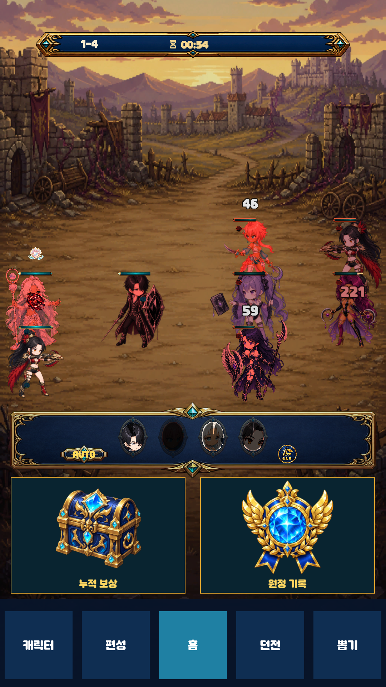
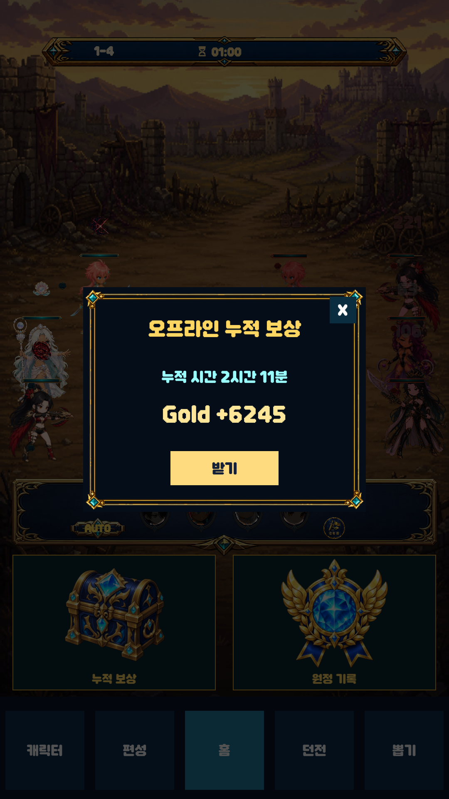
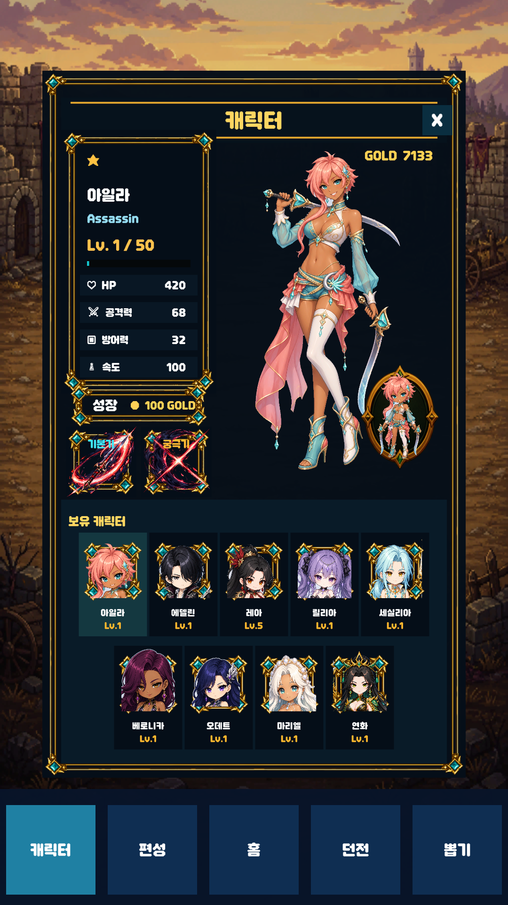
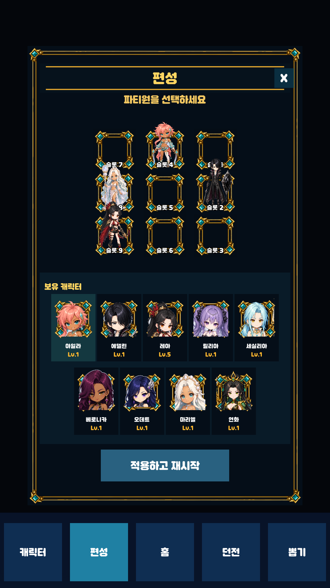

# 방치형 원정대

> 자동 전투로 골드를 획득하고, 캐릭터 성장과 4인 파티 편성을 반복하는 Unity 2D 방치형 RPG

## 플레이 화면

<p align="center">
  
  
  
  
</p>

| 자동 전투 | 오프라인 보상 | 캐릭터 성장 | 파티 편성 |
| :---: | :---: | :---: | :---: |
| 공격과 스킬 자동 진행 | 미접속 시간의 골드 수령 | 골드를 사용하는 레벨 업 | 4인 전투 파티 배치 |

## 프로젝트 정보

| 항목 | 내용 |
| --- | --- |
| 개발 형태 | 개인 프로젝트 |
| 제작 기간 | 2026.08.13 ~ 2026.09.02 |
| 개발 환경 | Unity 6000.3.13f1 |
| 사용 기술 | C#, CSV, JSON, Git |
| 콘텐츠 규모 | 캐릭터 9명, 4인 파티, 스테이지 10개 |

## 게임 소개

전투는 별도 입력 없이 자동으로 진행된다. 플레이어는 전투로 얻은 골드를 사용해 캐릭터를 성장시키고, 보유 캐릭터 가운데 4명을 선택해 파티를 편성한다. 스테이지를 클리어하면 다음 스테이지로 이동하며, 게임을 종료한 동안에도 마지막 진행 상황을 기준으로 오프라인 보상이 누적된다.

```text
자동 전투 → 골드 획득 → 캐릭터 성장 → 파티 편성 → 다음 스테이지
```

## 핵심 기능

### 1. CSV 기반 게임 데이터

- 캐릭터, 스킬, 적, 적 편성, 스테이지, 보상, 파티 슬롯을 CSV로 분리
- `DataManager`가 CSV를 런타임 데이터로 변환하고 ID 기반으로 조회
- `DataValidator`가 중복 ID, 누락된 참조, 잘못된 수치 범위를 시작 단계에서 검사
- 코드 수정 없이 CSV 값 변경만으로 능력치와 스테이지 구성을 조정

### 2. 자동 전투

- `BattleSession`이 전투 시간, 유닛 상태, 공격 순서, 스킬 쿨다운, 승패를 관리
- 캐릭터의 속도 수치를 기준으로 기본 공격 주기를 계산
- 단일 공격, 범위 공격, 후열 공격, 최저 체력 비율 대상 공격, 회복의 5개 스킬 효과 구현
- 자동 스킬 사용과 수동 스킬 사용을 모두 지원
- 승리 시 보상 지급 후 다음 스테이지로 이동하고, 일반 패배 시 같은 스테이지에 자동 재도전

### 3. 성장과 파티 편성

- 골드를 소비해 캐릭터 레벨 상승
- 레벨에 따라 체력, 공격력, 방어력 증가
- 보유 캐릭터 9명 중 4명을 전투 파티에 배치
- 동일 캐릭터와 동일 슬롯의 중복 배치를 차단

### 4. 저장과 오프라인 보상

- `JsonUtility`로 골드, 캐릭터 레벨, 파티 편성, 현재 스테이지를 JSON에 저장
- 임시 파일을 먼저 작성한 뒤 기존 저장 파일을 교체해 저장 중 파일 손상 가능성을 축소
- 불완전하거나 이전 형식인 저장 데이터를 불러올 때 누락 값을 기본값으로 보정
- 종료 시각과 재접속 시각의 차이를 계산해 최대 누적 시간 안에서 오프라인 골드 산출

### 5. 이벤트 기반 UI 갱신

- 전투 상태, 피해, 스킬 사용, 진행 데이터 변경을 이벤트로 전달
- UI가 게임 로직을 매 프레임 조회하지 않고 필요한 시점에만 화면을 갱신
- 전투 결과, 체력, 스킬 쿨다운, 성장 비용, 편성 상태, 오프라인 보상을 각 View에서 분리해 표시

## 구조

```text
Assets/
├─ Data/CSV/          게임 밸런스와 콘텐츠 데이터
├─ Scenes/UI/         실행 씬(main.unity)
└─ Scripts/
   ├─ Battle/         자동 전투와 스킬 효과
   ├─ Core/           초기화와 전체 진행 흐름
   ├─ Data/           CSV 파싱, 모델, 데이터 검증
   ├─ Progress/       성장, 편성, 저장, 오프라인 보상
   └─ UI/             화면별 View와 입력 처리
```

## 데이터 흐름

```text
CSV
  ↓
DataManager ── DataValidator
  ↓
GameManager
  ├─ BattleManager → BattleSession → 전투 이벤트 → UI
  └─ PlayerProgressModel ↔ SaveManager ↔ player-progress.json
```

## 실행 방법

1. 저장소를 복제한다.

   ```bash
   git clone https://github.com/syh8775/2d-idle-game.git
   ```

2. Unity Hub에서 복제한 폴더를 프로젝트로 추가한다.
3. Unity `6000.3.13f1`로 프로젝트를 연다.
4. `Assets/Scenes/UI/main.unity` 씬을 연다.
5. Play 버튼을 눌러 실행한다.

## 조작

| 입력 | 기능 |
| --- | --- |
| 캐릭터 카드 선택 | 성장 대상 선택 |
| 레벨 업 버튼 | 골드를 소비해 레벨 상승 |
| 편성 슬롯 선택 | 캐릭터 배치 또는 교체 |
| 스킬 버튼 | 준비된 스킬 수동 사용 |
| AUTO 버튼 | 스킬 자동 사용 전환 |
| F12 | 진행 데이터 초기화 |

## 저장 위치

진행 데이터는 Unity의 `Application.persistentDataPath` 아래 `player-progress.json`에 저장된다.
